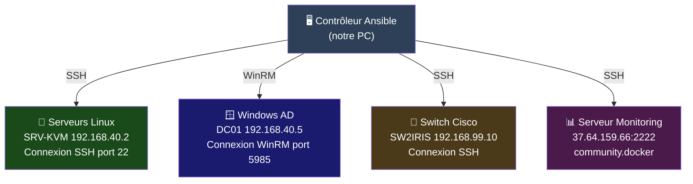
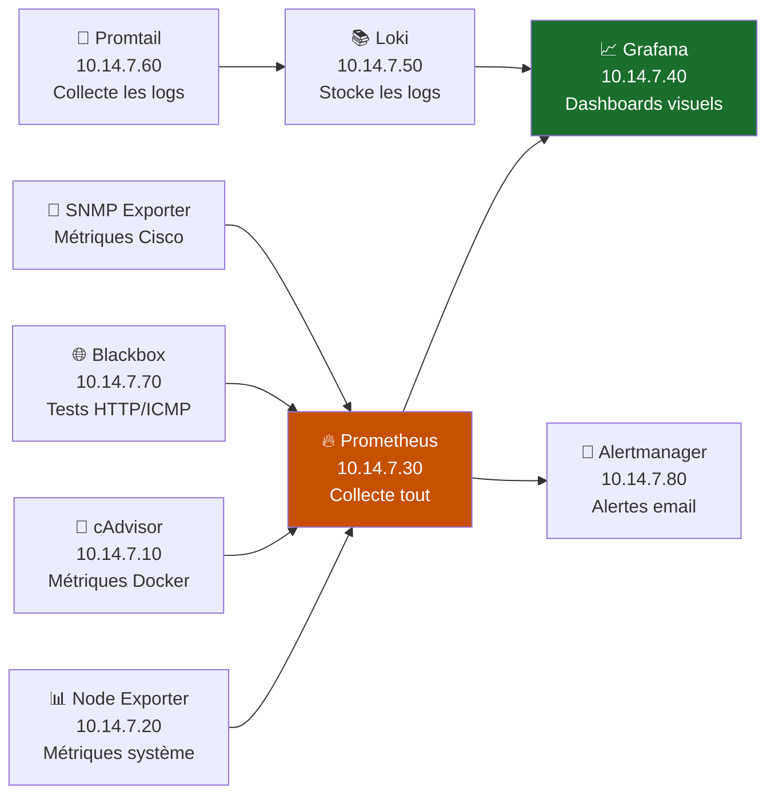
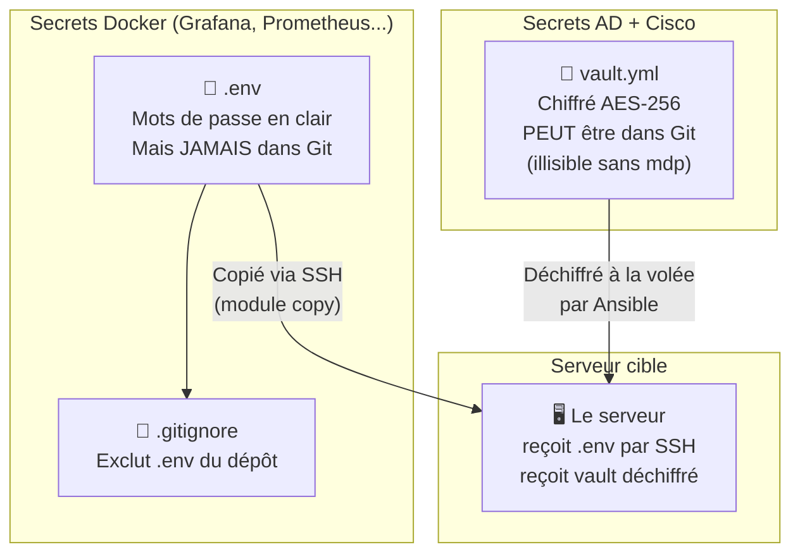
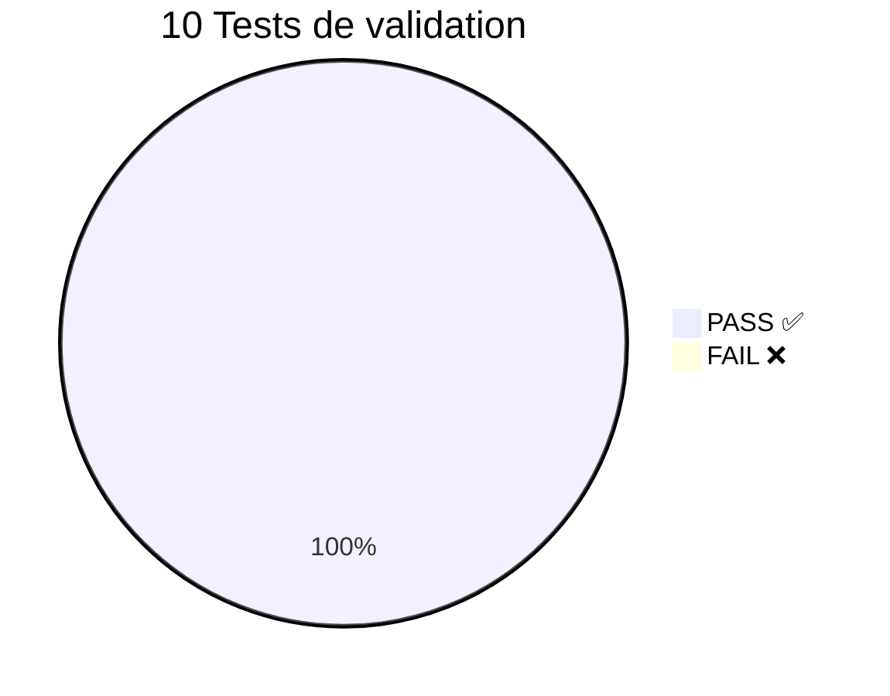
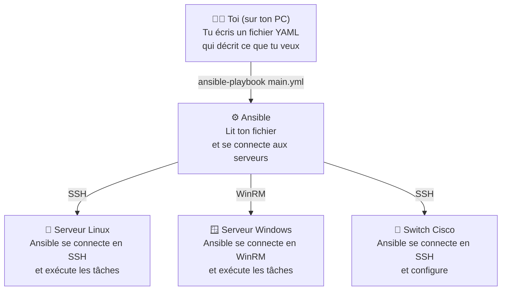
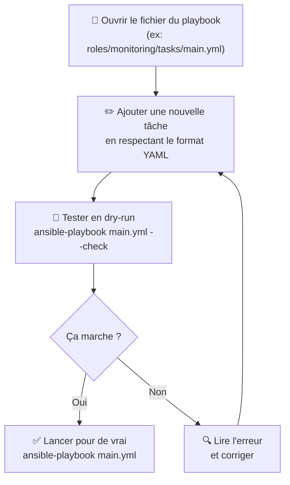
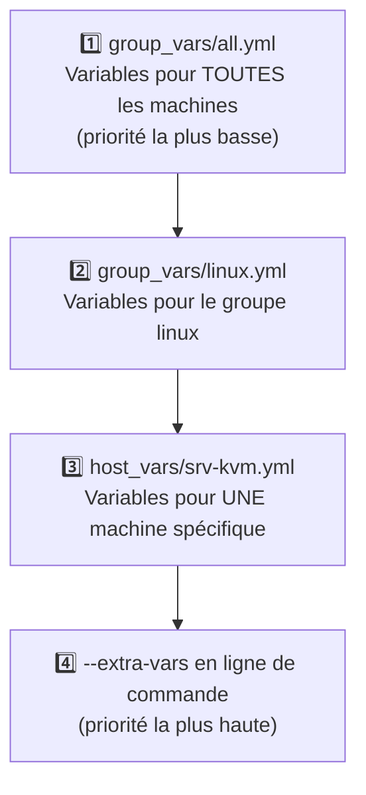
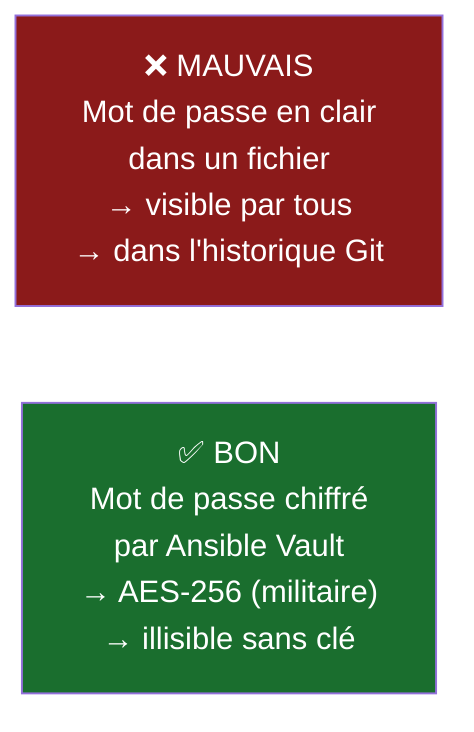
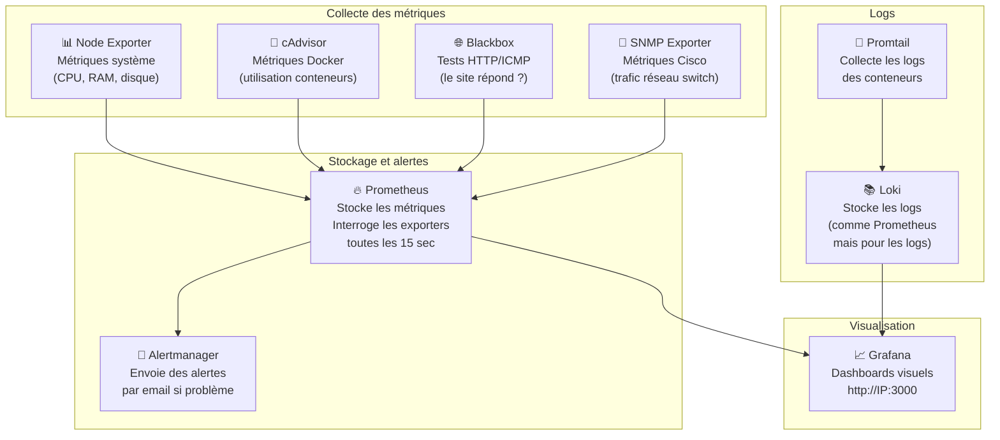
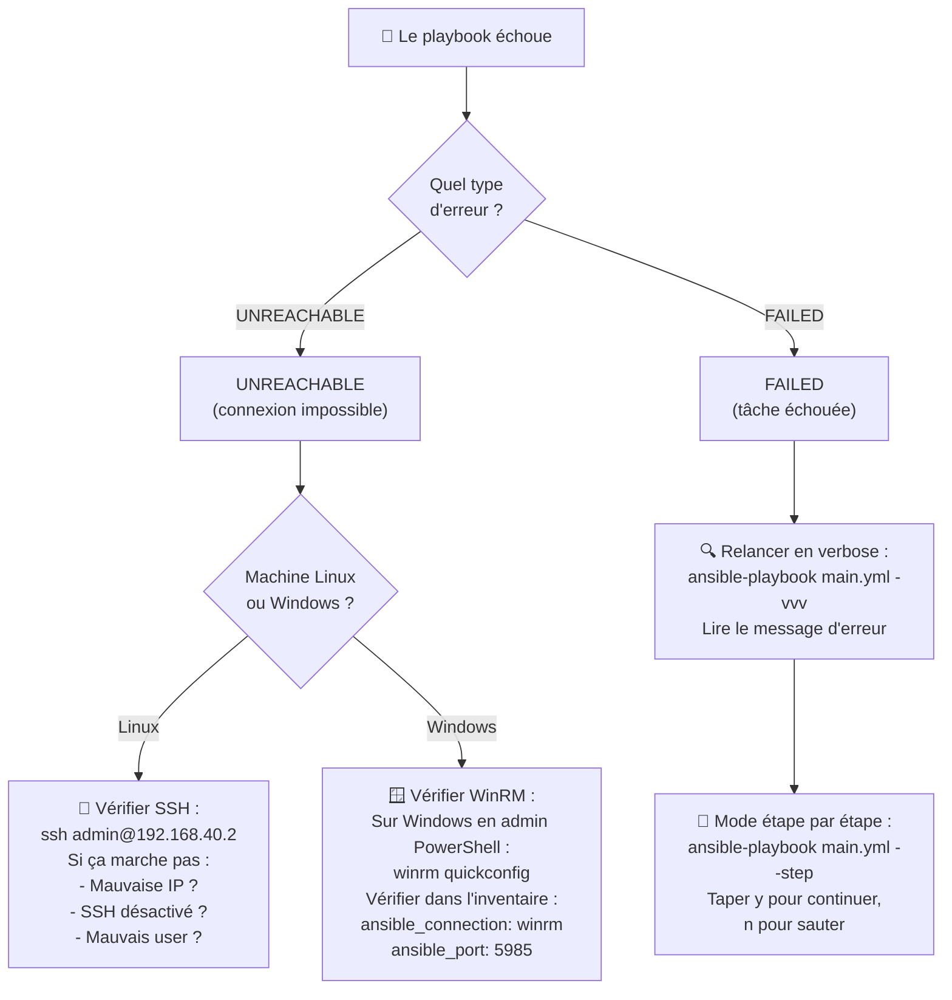

# RP-08 — Infrastructure as Code avec Ansible · IRIS Nice
## BTS SIO SISR · Réf : IRIS-NICE-2026-RP08 · Mars 2026

**Candidat : ANDREO Vincent** | Établissement : **IRIS Nice — Mediaschool**

| | |
|--|--|
| **Mission** | Automatiser l'infrastructure IRIS Nice via Ansible (IaC) — tâches répétitives, secrets sécurisés, idempotence |
| **Outil** | Ansible 2.15 · agentless SSH · collection `community.docker >= 4.0.0` |
| **Livrable principal** | Déploiement monitoring stack complet via playbook + rôle Ansible |
| **Inventaire** | Switches Cisco · Serveurs Linux · Windows AD · Hyperviseur KVM |
| **Secrets** | `.env` hors Git · `.gitignore` · aucun mot de passe en clair |

> Idempotent · Reproductible · Versionné sur Git · Dry-run documenté

---

# Contexte — Administration 100 % manuelle · Infrastructure V7 complète
## IRIS Nice · Le problème posé par Yan

**Infrastructure V7 déjà opérationnelle :**

- RP-01 Réseau Cisco · RP-02 Active Directory · RP-03 Supervision · RP-04 KVM · RP-05 pfSense/Audit · RP-06 BorgBackup · RP-07 VPN

**Problèmes d'administration manuelle :**

| Tâche | Temps manuel | Problème concret |
|-------|-------------|-----------------|
| **Rentrée : 20 comptes AD** | 2 jours · 2 personnes | Oublis · erreurs de saisie fréquents |
| **Déploiement VMs étudiants** | 4–5 h non reproductibles | Configurations non uniformes |
| **Mises à jour Linux + Windows** | 3 h non coordonnées | Serveurs non synchronisés · failles actives |
| **Vérification conformité** | Jamais réalisée | Dérives silencieuses non détectées |
| **Secrets dans fichiers texte** | — | Mots de passe en clair · risque critique |


> *"Avec 7 RP déployées, le maintien de la conformité est devenu impossible à contrôler manuellement."* — Yan

---

# Solution — Ansible IaC · Benchmark et Architecture
## Ansible retenu · Inventaire structuré · Secrets via Vault

**Pourquoi Ansible et pas un autre outil ?**

| Critère | Ansible | Terraform | Chef/Puppet |
|---------|---------|-----------|-------------|
| Agentless (rien à installer sur les serveurs) | ✅ SSH pur | ✅ | ❌ Agent requis |
| Gère Windows + Active Directory | ✅ WinRM | ❌ | ✅ |
| Gère les switchs Cisco | ✅ `cisco.ios` | Limité | ❌ |
| Facile à apprendre | **Facile** | Moyen | Difficile |
| Prix | **Gratuit** | Gratuit | Payant |

> **Ansible retenu** — agentless, multi-OS (Linux · Windows · Cisco), facile à apprendre, gratuit



**Principe :** Ansible se connecte depuis NOTRE PC vers chaque machine (SSH pour Linux/Cisco, WinRM pour Windows). **Rien à installer** sur les serveurs.

---

# Livrable Principal — Playbook Monitoring · Rôle Ansible · 8 Services
## Projet réel déployé : Vince_monitoring_ansible

**Rôle `monitoring` — 5 tasks Ansible :**

| Task | Module Ansible | Ce que ça fait en français |
|------|--------|--------|
| 1 | `file` | Crée le dossier `/home/vincent/monitoring` sur le serveur |
| 2 | `community.docker.docker_network` | Crée un réseau Docker dédié `10.14.7.0/24` avec IPs fixes pour chaque service |
| 3 | `copy` | Copie le fichier `.env` (secrets) depuis notre PC vers le serveur |
| 4 | `ansible.posix.synchronize` | Synchronise les fichiers de config (prometheus, grafana, loki) vers le serveur |
| 5 | `community.docker.docker_compose_v2` | Lance les 8 services Docker en une commande |



**Déploiement complet en UNE commande :**

```bash
ansible-playbook -i inventories/hosts.yml main.yml
# PLAY RECAP → ok=5  changed=5  unreachable=0  failed=0
```

---

# Playbooks Conçus — Rentrée · Patch · Conformité
## 3 playbooks couvrant les tâches les plus fréquentes

**Playbook 1 — `rentree-scolaire.yml` :**


> **Avant :** 2 jours · 2 personnes · erreurs fréquentes → **Après :** 1 commande · quelques minutes · 0 erreur

**Playbook 2 — `patch-management.yml` :**

| Étape | Ce que ça fait | Pourquoi |
|-------|---------------|---------|
| Snapshot pré-patch | Sauvegarde l'état des VMs avant mise à jour | Si la mise à jour casse quelque chose, on peut revenir en arrière |
| `apt upgrade` Linux | Met à jour tous les paquets Linux | Corriger les failles de sécurité |
| Windows Update DC01 | Lance les mises à jour Windows | Idem |
| Vérification AD/DNS | Vérifie que AD et DNS fonctionnent après | S'assurer que rien n'est cassé |

**Playbook 3 — `conformite.yml` :**

Vérifie automatiquement que les serveurs respectent les règles de sécurité (CIS, ANSSI). Génère un rapport conforme/non-conforme.

---

# Sécurité — Ansible Vault + .env · Idempotence · Git
## Secrets Docker via .env · Secrets AD/Cisco via Ansible Vault AES-256



**En résumé :**
- Les secrets Docker → fichier `.env` exclu de Git (dans `.gitignore`)
- Les secrets AD/Cisco → fichier `vault.yml` chiffré AES-256, peut rester dans Git car illisible

**Idempotence — C'est quoi ?**

| Run | changed | Ce que ça veut dire |
|-----|---------|-------------------|
| 1er déploiement | 5 | Normal : Ansible a créé/modifié 5 choses |
| 2e run sans rien changer | **0** | **Idempotence prouvée** : Ansible vérifie que tout est déjà en place et ne touche à rien |

> On peut relancer 10 fois le playbook, ça ne casse jamais rien.

---

# Résultats — PV de Tests · 10 Tests · 10/10 PASS
## Idempotence · Dry-run · Déploiement complet validé

| Test | Comment on vérifie | Résultat |
|------|-------------------|---------|
| Connectivité Ansible | `ansible monitoring-server -m ping` → doit répondre `pong` | ✅ PASS |
| Déploiement playbook | `ansible-playbook main.yml` → ok=5 failed=0 | ✅ PASS |
| 8 services Docker | `docker ps` → 8 conteneurs "Up" | ✅ PASS |
| Prometheus targets | Page `/targets` → 4 jobs en vert | ✅ PASS |
| SNMP Cisco | Job `snmp_cisco` → UP | ✅ PASS |
| Grafana HTTP | `http://37.64.159.66:3000` → code 200 | ✅ PASS |
| Alertmanager HTTP | `http://37.64.159.66:9093` → code 200 | ✅ PASS |
| Loki collecte | Promtail pousse des logs → Loki les reçoit | ✅ PASS |
| **Idempotence** | 2e run → changed=0 | ✅ PASS |
| **Dry-run** | `--check --diff` → 0 changement inattendu | ✅ PASS |



---

# Bilan — Manuel → IaC · 10 Livrables · Compétences BTS validées
## Avant / Après · AO IRIS-NICE-2026-RP08 couvert à 100 %


| Livrable | Statut |
|----------|--------|
| Benchmark IaC · Ansible retenu | ✅ |
| Inventaire structuré (4 groupes) | ✅ |
| Playbook monitoring (déployé · prouvé) | ✅ |
| Playbooks rentrée · patch · conformité (conçus) | ✅ |
| Rôle Ansible `monitoring` documenté | ✅ |
| Secrets hors Git (.env + .gitignore) | ✅ |
| Idempotence vérifiée (changed=0) | ✅ |
| Dry-run documenté (--check --diff) | ✅ |
| Dépôt Git structuré + README | ✅ |
| PV de tests 10/10 PASS | ✅ |

**Compétences BTS SIO validées : B2.2 · B3.1 · B3.2**

---

---

# 🔧 SECTION CHEAT SHEETS — AIDE POUR MODIFICATIONS EN DIRECT

---

# CHEAT SHEET 1 — C'est quoi Ansible ? (les bases pour comprendre)

## Le principe d'Ansible en un schéma



**En gros :** au lieu de se connecter à chaque serveur et taper des commandes à la main, on écrit un fichier qui décrit ce qu'on veut, et Ansible le fait tout seul sur toutes les machines.

## Les fichiers importants de notre projet

| Fichier / Dossier | C'est quoi | En français |
|-------------------|-----------|-------------|
| `inventories/hosts.yml` | L'inventaire | La liste de TOUTES les machines avec leur IP et comment s'y connecter |
| `main.yml` | Le playbook principal | Le fichier qui dit "fais ça sur ces machines" |
| `roles/monitoring/tasks/main.yml` | Les tâches du rôle | Les étapes détaillées (créer dossier, copier fichiers, lancer Docker...) |
| `group_vars/` | Les variables par groupe | Les paramètres spécifiques à chaque type de machine |
| `.env` | Les secrets Docker | Mots de passe Grafana, etc. (exclu de Git) |
| `group_vars/windows/vault.yml` | Les secrets AD/Cisco | Chiffré AES-256 par Ansible Vault |

## Vocabulaire clé

| Mot | Explication simple |
|-----|-------------------|
| **Playbook** | Comme une recette de cuisine : les étapes à suivre dans l'ordre |
| **Task** | Une étape dans la recette (ex: "installer nginx") |
| **Role** | Un ensemble de tasks regroupées (ex: le rôle "monitoring" contient 5 tasks) |
| **Inventaire** | La liste des machines ciblées avec leurs infos de connexion |
| **Module** | L'outil qu'Ansible utilise pour faire une action (ex: `apt` pour installer, `copy` pour copier) |
| **Idempotent** | On peut relancer 10 fois, ça ne casse rien (changed=0 au 2e run) |
| **Agentless** | Rien à installer sur les serveurs, Ansible se connecte en SSH/WinRM |

---

# CHEAT SHEET 2 — Commandes Ansible (expliquées pas à pas)

## Tester si Ansible peut se connecter aux machines

| Commande | Ce que ça fait | Si ça marche | Si ça marche pas |
|----------|---------------|-------------|-----------------|
| `ansible all -i inventories/hosts.yml -m ping` | Teste la connexion vers TOUTES les machines | Affiche `pong` en vert | Affiche `UNREACHABLE` en rouge → vérifier IP/SSH/mot de passe |
| `ansible monitoring-server -m ping` | Teste UN SEUL serveur | `pong` | Vérifier l'inventaire |
| `ansible windows -m win_ping` | Teste les machines Windows (via WinRM) | `pong` | Vérifier WinRM (voir cheat sheet dépannage) |

> **`-m ping`** = module ping. C'est juste un test de connexion, pas un vrai ping réseau.

## Lancer un playbook (exécuter les tâches)

| Commande | Ce que ça fait | Quand l'utiliser |
|----------|---------------|-----------------|
| `ansible-playbook -i inventories/hosts.yml main.yml` | Exécute TOUT le playbook sur toutes les machines | Déploiement réel |
| `ansible-playbook main.yml --check --diff` | **Simule** sans rien modifier. Montre ce qui SERAIT changé | Pour montrer au prof sans risque ! |
| `ansible-playbook main.yml --limit linux` | Exécute seulement sur le groupe "linux" | Si on veut cibler un seul groupe |
| `ansible-playbook main.yml -v` | Mode verbose (plus de détails dans les logs) | Quand on veut comprendre ce qui se passe |
| `ansible-playbook main.yml -vvv` | Mode TRÈS verbose (chaque détail affiché) | Quand quelque chose ne marche pas |
| `ansible-playbook main.yml --step` | Demande confirmation avant CHAQUE tâche | Pour montrer étape par étape au prof |

## Comprendre le résultat (PLAY RECAP)

```
PLAY RECAP ****
monitoring-server : ok=5  changed=5  unreachable=0  failed=0
```

| Compteur | Couleur | Ce que ça veut dire |
|----------|---------|-------------------|
| **ok=5** | Vert | 5 tâches ont été exécutées avec succès |
| **changed=5** | Jaune | 5 choses ont été modifiées sur le serveur |
| **unreachable=0** | — | Aucune machine injoignable |
| **failed=0** | — | Aucune erreur (si > 0 = problème !) |

> Au **2e run** sans modif : `changed=0` = **idempotence prouvée**

---

# CHEAT SHEET 3 — Modifier l'inventaire et les playbooks

## Ajouter une nouvelle machine dans l'inventaire

Le fichier `inventories/hosts.yml` contient la liste des machines :

```yaml
# Exemple de notre inventaire
[linux]
srv-kvm ansible_host=192.168.40.2 ansible_user=admin

# Pour ajouter un nouveau serveur Linux :
nouveau-srv ansible_host=192.168.40.10 ansible_user=admin

[windows]
dc01 ansible_host=192.168.40.5 ansible_connection=winrm ansible_port=5985

[network]
sw2iris ansible_host=192.168.99.10

[monitoring]
monitoring-server ansible_host=37.64.159.66 ansible_port=2222
```

| Paramètre | C'est quoi |
|-----------|-----------|
| `ansible_host` | L'adresse IP de la machine |
| `ansible_user` | Le login pour se connecter (SSH) |
| `ansible_connection` | Le type de connexion : `ssh` (défaut) ou `winrm` (Windows) |
| `ansible_port` | Le port (22 par défaut pour SSH, 5985 pour WinRM) |

## Ajouter une tâche dans un playbook



**Exemple : ajouter une tâche "installer nginx" :**

```yaml
- name: Installer le serveur web nginx
  ansible.builtin.apt:
    name: nginx
    state: present
  become: true
```

| Ligne | Ce que ça veut dire |
|-------|-------------------|
| `- name: Installer...` | Le nom de la tâche (en français c'est OK, c'est juste un commentaire) |
| `ansible.builtin.apt:` | Le module utilisé : `apt` = gestionnaire de paquets Debian/Ubuntu |
| `name: nginx` | Le nom du paquet à installer |
| `state: present` | On veut que nginx soit installé. Si déjà installé = rien ne se passe (idempotent) |
| `become: true` | Exécuter en `sudo` (droits administrateur) |

> ⚠️ **YAML est sensible à l'indentation !** Toujours utiliser **2 espaces** (pas de tabulations).

## Priorité des variables (du moins prioritaire au plus prioritaire)



---

# CHEAT SHEET 4 — Ansible Vault (les secrets / mots de passe)

## Pourquoi Vault ?



**Règle d'or :** On ne met **JAMAIS** de mot de passe en clair dans un fichier Git.

## Commandes Vault expliquées

| Commande | Ce que ça fait | Quand l'utiliser |
|----------|---------------|-----------------|
| `ansible-vault create group_vars/windows/vault.yml` | Crée un NOUVEAU fichier chiffré. Demande un mot de passe, puis ouvre un éditeur pour écrire les secrets. | Première fois qu'on crée les secrets |
| `ansible-vault edit group_vars/windows/vault.yml` | Ouvre un fichier chiffré existant pour le modifier. Demande le mot de passe Vault. | Modifier un mot de passe existant |
| `ansible-vault view group_vars/windows/vault.yml` | Affiche le contenu déchiffré (lecture seule). | Vérifier un secret sans le modifier |
| `ansible-playbook main.yml --ask-vault-pass` | Lance le playbook et demande le mot de passe Vault. | À chaque fois qu'on lance un playbook qui utilise des secrets |

**Notre architecture de secrets :**

| Type de secret | Mécanisme | Dans Git ? |
|---------------|-----------|-----------|
| Secrets Docker (Grafana, Prometheus...) | Fichier `.env` copié par SSH | ❌ Non, exclu par `.gitignore` |
| Secrets AD + Cisco (mots de passe admin) | Fichier `vault.yml` chiffré AES-256 | ✅ Oui, mais illisible sans le mot de passe Vault |

---

# CHEAT SHEET 5 — Docker et Monitoring (Prometheus, Grafana, Loki)

## Docker — C'est quoi ?

Docker = des **conteneurs** (comme des mini-machines virtuelles ultra légères). Chaque service tourne dans son propre conteneur isolé.

## Commandes Docker essentielles

| Commande | Ce que ça fait | Ce que tu dois voir |
|----------|---------------|-------------------|
| `docker ps` | Liste les conteneurs en cours | 8 conteneurs avec le statut "Up" |
| `docker ps -a` | Liste TOUS les conteneurs (même arrêtés) | Utile si un conteneur a crashé |
| `docker logs prometheus` | Affiche les logs de Prometheus | Utile pour comprendre une erreur |
| `docker logs grafana --tail 50` | Affiche les 50 dernières lignes de log de Grafana | Pour voir les erreurs récentes |
| `docker restart grafana` | Redémarre le conteneur Grafana | Si Grafana ne répond plus |
| `docker compose up -d` | Démarre TOUTE la stack (8 services) | `-d` = en arrière-plan |
| `docker compose down` | Arrête TOUTE la stack | Pour maintenance |
| `docker compose up -d --force-recreate` | Recrée tous les conteneurs | Après une modification de config |

## Nos 8 services de monitoring



## Accéder aux interfaces web

| Service | URL | Login |
|---------|-----|-------|
| **Grafana** (dashboards) | `http://37.64.159.66:3000` | admin / admin (par défaut) |
| **Prometheus** (métriques) | `http://37.64.159.66:9090` | pas de login |
| **Prometheus Targets** (état des jobs) | `http://37.64.159.66:9090/targets` | Tout doit être en vert "UP" |
| **Alertmanager** (alertes) | `http://37.64.159.66:9093` | pas de login |

---

# CHEAT SHEET 6 — Dépannage : quand ça ne marche pas

## Arbre de décision pour debugger



## Erreurs les plus fréquentes et solutions

| Erreur | Ce que ça veut dire | Solution |
|--------|-------------------|---------|
| `UNREACHABLE! => SSH connection refused` | Le serveur refuse la connexion SSH | Vérifier que SSH tourne : `sudo systemctl status sshd` |
| `UNREACHABLE! => No route to host` | La machine n'est pas joignable sur le réseau | Vérifier l'IP dans l'inventaire, faire un `ping` |
| `FAILED! => Permission denied` | Pas les droits pour exécuter la commande | Ajouter `become: true` dans la tâche (= sudo) |
| `FAILED! => Module not found` | Le module Ansible n'est pas installé | `ansible-galaxy collection install community.docker` |
| `ERROR! Vault password is required` | Le playbook utilise des secrets Vault | Ajouter `--ask-vault-pass` à la commande |
| Erreur YAML (indentation) | Mauvais espaces dans le fichier | Vérifier l'indentation : toujours 2 espaces, jamais de tabulations |

## Vérifier que tout fonctionne après une modification

| Étape | Commande | Ce que tu vérifies |
|-------|---------|-------------------|
| 1 | `ansible all -m ping` | Toutes les machines répondent |
| 2 | `ansible-playbook main.yml --check --diff` | Le dry-run ne montre pas d'erreur |
| 3 | `ansible-playbook main.yml` | Le déploiement passe ok=5 failed=0 |
| 4 | `docker ps` (sur le serveur) | Les 8 conteneurs sont "Up" |
| 5 | Ouvrir Grafana dans le navigateur | Les dashboards s'affichent |

## Sauvegarder les modifications avec Git

| Commande | Ce que ça fait |
|----------|---------------|
| `git status` | Voir quels fichiers ont été modifiés |
| `git diff` | Voir le détail des modifications |
| `git add -A` | Ajouter toutes les modifications |
| `git commit -m "description de la modif"` | Sauvegarder avec un message |
| `git log --oneline -5` | Voir les 5 derniers commits |

---

**Technologies : Ansible 2.15 · community.docker · Docker Compose V2 · Prometheus · Grafana · Loki · SNMP · WinRM · cisco.ios**

**ANDREO Vincent · BTS SIO SISR · IRIS Nice · Mars 2026**
