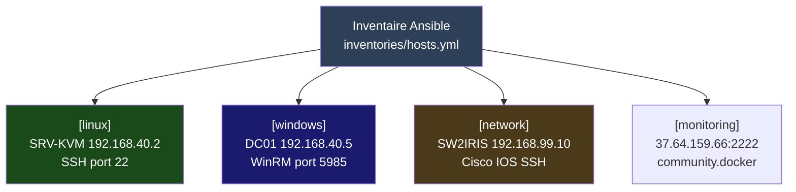
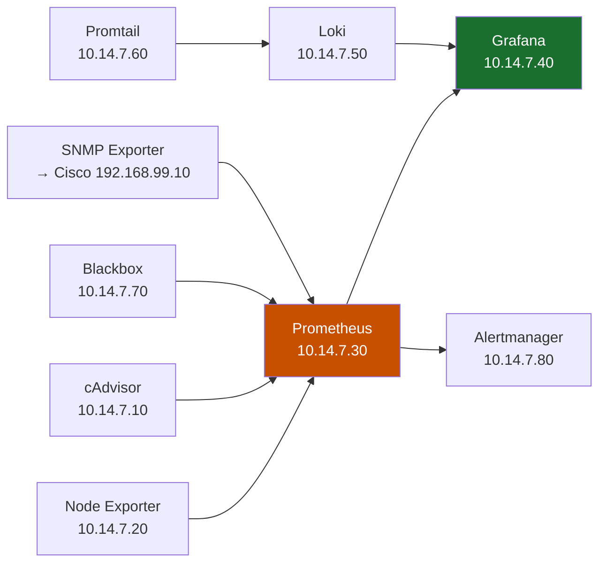
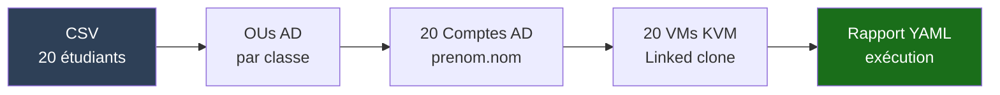
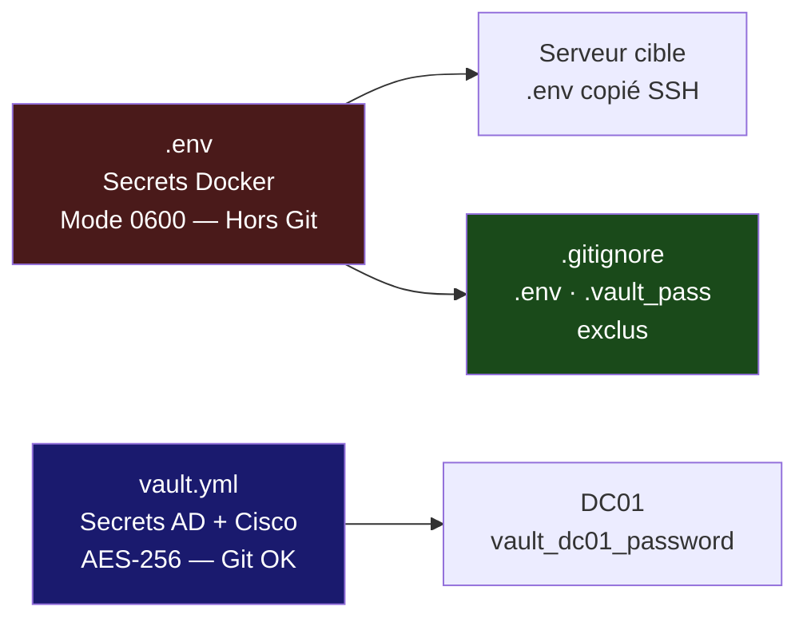
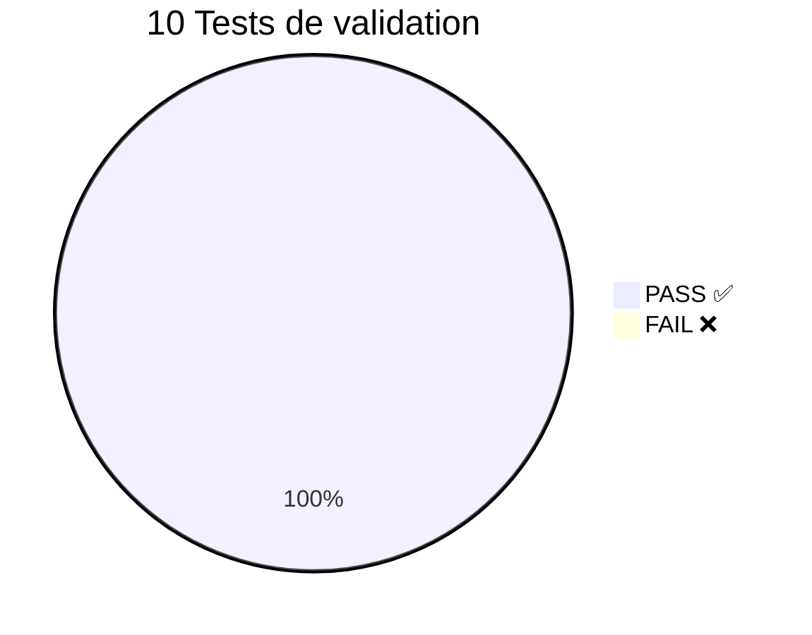

# RP-08 — Infrastructure as Code avec Ansible · IRIS Nice
## BTS SIO SISR · Réf : IRIS-NICE-2026-RP08 · Mars 2026

**Candidat : ANDREO Vincent** | Établissement : **IRIS Nice — Mediaschool**

| | |
|--|--|
| **Mission** | Automatiser l'infrastructure IRIS Nice via Ansible (IaC) — tâches répétitives, secrets sécurisés, idempotence |
| **Outil** | Ansible 2.15 · agentless SSH · collection `community.docker >= 4.0.0` |
| **Livrable principal** | Déploiement monitoring stack complet via playbook + rôle Ansible |
| **Inventaire** | Switches Cisco · Serveurs Linux · Windows AD · Hyperviseur KVM |
| **Secrets** | `.env` hors Git · `.gitignore` · aucun mot de passe en clair |

> Idempotent · Reproductible · Versionné sur Git · Dry-run documenté

---

# Contexte — Administration 100 % manuelle · Infrastructure V7 complète
## IRIS Nice · Le problème posé par Yan

**Infrastructure V7 déjà opérationnelle :**

- RP-01 Réseau Cisco · RP-02 Active Directory · RP-03 Supervision · RP-04 KVM · RP-05 pfSense/Audit · RP-06 BorgBackup · RP-07 VPN

**Problèmes d'administration manuelle (mail de Yan) :**

| Tâche | Temps manuel | Problème concret |
|-------|-------------|-----------------|
| **Rentrée : 20 comptes AD** | 2 jours · 2 personnes | Oublis · erreurs de saisie fréquents |
| **Déploiement VMs étudiants** | 4–5 h non reproductibles | Configurations non uniformes |
| **Mises à jour Linux + Windows** | 3 h non coordonnées | Serveurs non synchronisés · failles actives |
| **Vérification conformité** | Jamais réalisée | Dérives silencieuses non détectées |
| **Secrets dans fichiers texte** | — | Mots de passe en clair · risque critique |

> *"Avec 7 RP déployées, le maintien de la conformité est devenu impossible à contrôler manuellement."* — Yan

---

# Solution — Ansible IaC · Benchmark et Architecture
## Ansible retenu · Inventaire structuré · Secrets via Vault

**Benchmark des solutions IaC :**

| Critère | Ansible | Terraform | Chef/Puppet |
|---------|---------|-----------|-------------|
| Agentless | ✅ SSH pur | ✅ | ❌ Agent requis |
| Windows AD | ✅ WinRM | ❌ | ✅ |
| Réseau Cisco | ✅ `cisco.ios` | Limité | ❌ |
| Courbe d'apprentissage | **Faible** | Moyenne | Élevée |
| Budget | **Gratuit** | Gratuit | Payant |

> **Ansible retenu** — agentless, multi-OS (Linux · Windows · Cisco), courbe d'apprentissage faible

**Architecture de l'inventaire :**



---

# Livrable Principal — Playbook Monitoring · Rôle Ansible · 8 Services
## Projet réel déployé : Vince_monitoring_ansible

**Rôle `monitoring` — 5 tasks Ansible :**

| Task | Module | Action |
|------|--------|--------|
| 1 | `file` | Crée `/home/vincent/monitoring` mode 755 |
| 2 | `community.docker.docker_network` | Réseau `10.14.7.0/24` IPs fixes |
| 3 | `copy` | `.env` (secrets) → serveur, mode 644 |
| 4 | `ansible.posix.synchronize` | Sync configs prometheus/grafana/loki |
| 5 | `community.docker.docker_compose_v2` | 8 services · `pull: always` |

**8 services supervisent l'infrastructure V7 :**



```bash
# Déploiement complet en une commande
ansible-playbook -i inventories/hosts.yml main.yml
# PLAY RECAP → ok=5  changed=5  unreachable=0  failed=0
```

---

# Playbooks Conçus — Rentrée · Patch · Conformité
## 3 playbooks couvrant les tâches les plus fréquentes

**Playbook 1 — `rentree-scolaire.yml` :**



**Playbook 2 — `patch-management.yml` :**

| Étape | Cible | Module |
|-------|-------|--------|
| Snapshot pré-patch | KVM | `community.libvirt` |
| `apt upgrade` Linux | SRV-KVM | `ansible.builtin.apt` |
| Windows Update DC01 | WinRM | `community.windows` |
| Vérification AD/DNS | DC01 | `win_service` |

**Playbook 3 — `conformite.yml` :**

| Zone | Contrôles | Résultat attendu |
|------|-----------|-----------------|
| Linux SSH · UFW | 8 contrôles CIS | Conforme ou rapport |
| Windows GPOs · Defender | 6 contrôles ANSSI | Conforme ou rapport |
| Cisco VLANs · ACLs | 4 contrôles réseau | Conforme ou rapport |

---

# Sécurité — Architecture Hybride · Ansible Vault + .env · Idempotence · Git
## Secrets Docker via .env · Secrets AD/Cisco via Ansible Vault AES-256

**Architecture hybride des secrets :**

| Type | Mécanisme | Versionnable |
|------|-----------|-------------|
| Grafana, services Docker | `.env` hors Git | ❌ En clair |
| DC01 AD, SW2IRIS Cisco | Ansible Vault `vault.yml` AES-256 | ✅ Chiffré |



**Commandes Ansible Vault :**

```bash
ansible-vault create group_vars/windows/vault.yml
ansible-playbook rentree-scolaire.yml --ask-vault-pass
```

**Idempotence · Dry-run :**

| Run | changed | Résultat |
|-----|---------|---------|
| 1er déploiement | 5 | ✅ Stack déployée |
| 2e run sans modif | **0** | ✅ Idempotence confirmée |

```bash
ansible-playbook main.yml --check --diff   # 0 changement inattendu ✅
```

---

# Résultats — PV de Tests · 10 Tests · 10/10 PASS
## Idempotence · Dry-run · Déploiement complet validé

| Test | Commande / Vérification | Résultat |
|------|------------------------|---------|
| Connectivité Ansible | `ansible monitoring-server -m ping` | ✅ `pong` |
| Déploiement playbook | `ansible-playbook main.yml` | ✅ ok=5 failed=0 |
| 8 services Docker | `docker ps` sur serveur | ✅ 8/8 Up |
| Prometheus targets | `/targets` — 4 jobs | ✅ UP |
| SNMP Cisco SW2IRIS | Job `snmp_cisco` 192.168.99.10 | ✅ UP |
| Grafana HTTP | `http://37.64.159.66:3000` | ✅ 200 |
| Alertmanager HTTP | `http://37.64.159.66:9093` | ✅ 200 |
| Loki collecte | Push Promtail actif | ✅ Logs reçus |
| **Idempotence** | 2e run sans modif | ✅ changed=0 |
| **Dry-run** | `--check --diff` | ✅ 0 changement inattendu |



---

# Bilan — Manuel → IaC · 10 Livrables AO · Compétences BTS validées
## Avant / Après · AO IRIS-NICE-2026-RP08 couvert à 100 %


| Livrable AO | Statut |
|-------------|--------|
| Benchmark IaC · Ansible retenu | ✅ |
| Inventaire structuré (4 groupes) | ✅ |
| Playbook monitoring (déployé · prouvé) | ✅ |
| Playbooks rentrée · patch · conformité (conçus) | ✅ |
| Rôle Ansible `monitoring` documenté | ✅ |
| Secrets hors Git (.env + .gitignore) | ✅ |
| Idempotence vérifiée (changed=0) | ✅ |
| Dry-run documenté (--check --diff) | ✅ |
| Dépôt Git structuré + README | ✅ |
| PV de tests 10/10 PASS | ✅ |

**Compétences BTS SIO validées : B2.2 · B3.1 · B3.2**

**Technologies : Ansible 2.15 · community.docker · Docker Compose V2 · Prometheus · Grafana · Loki · SNMP · WinRM · cisco.ios**

**ANDREO Vincent · BTS SIO SISR · IRIS Nice · Mars 2026**
